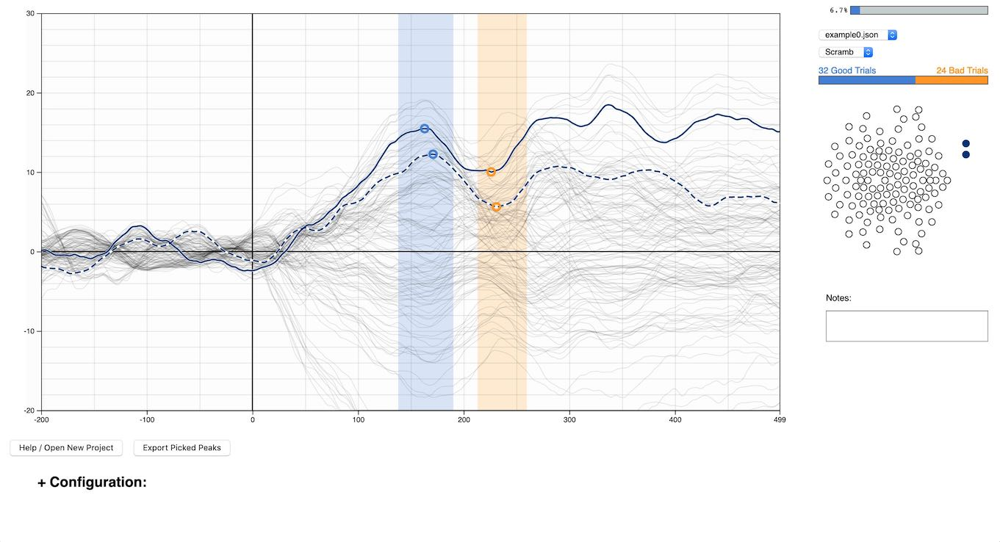

# WEPP
Browser based tool for manual peak picking for ERP data.



--

## Usage
WEPP (Web ERP Peak Picker) is a GUI tool for picking peak features in ERP data. To use, simply visit the live version [HERE](http://locuscoerule.us/WEPP/) or clone this repository, navigate to it in a terminal, and run:  

```
npm install
npm start
```  
to open run it locally on your machine. This requires Node.js to be installed on your machine.

### Loading a Project Folder
Upon loading WEPP, you will be prompted to load a project folder. Simply use the browse dialogue window to select a folder, or drag a folder into the area on screen.

__THESE DATA WILL NOT BE UPLOADED ANYWHERE__, this simply makes your data available to the browser application, and WEPP by extension.

Each project folder should contain JSON files in the format described below in the [Data](#data) section. It is recommended to only have files from one experiement in a given project folder, so all the files have the same structure.

### Controls
To pick peaks, simply click and drag on the plot to select a window of time from which a peak for each selected channel will be calculated. Using the __left__ mouse button will pick __positive__ peaks, while the __right__ mouse button will pick __negative__ peaks.

Peaks can be discarded by selecting them with the mouse, and hitting the delete button.

Channels can be selected/deselected by clicking on the channel in the channel map to the right of the main plot. By default, all channels with names that do not conform to the pattern "E\d+" (eg E1 E120 E20) will be selected.

Notes can also added through the Notes text box. Notes are shared by all peaks in a given file + bin.

Once you are satisfied with the peaks for a particular bin, you can hit the __space bar__ to save the peaks and continue to the next bin or file.

You can also navigate through bins and files with the __left arrow__ and __right arrow__ keys. Note that this will discard any peaks you may have.

Saved peaks can be downloaded as a CSV file by clicking on the Export Picked Peaks button at any time.

If the plot doesn't properly show your data, you can adjust the y-axis by dragging it up and down.

### Configuration

Various configuration options can further improve the peak picking process.

__Default Time Windows__, if set, will automatically pick peaks using the set time window when switching to a new bin or file. There is one window for positive peaks and one for negative peaks.

__Bin Selection__ allows some bins to be ignored altogether. At least one bin must remain selected.

__Redcap API__ configuration allows WEPP to upload your picked peaks to a Redcap database automatically. An example Data Dictonary is available in the `/util` folder. Peaks are uploaded upon completing an individual file. Any modifications to peaks previously uploaded will be sent again, but __will not overwrite previous peaks__. Please be aware of this, and account for the possibility of duplicate peaks in the data if you use this feature. To avoid this, you can download the peaks as a CSV, and upload them manually.

__Save / Load__: Click either button to save or load a configuration file. If a configuration file is saved, and moved into a project folder, it will automatically be loaded along with the project folder.

Note that selection of channels will be in a saved  configuration file as well.


### Data

ERP data is expected to be in a JSON format. These fiels can be generated from ERPLab .erp files using the script in the `/utils` folder.

The internal structure for the expected JSON is as follows:

```
{
  chans: ["E1","E2" ...],
  chanlocs: [ [x,y], [x,y] ...],
  sampleRate: 1000,
  times: [-200,-199 ... 300],
  bins: [
  	{
  	  name: "VEP",
  	  bad: 10,
  	  good: 40,
  	  data: [
  	  	[ch1t1, ch1t2 ...],
  	  	[ch2t1, ch2t2 ...],
  	  	...
  	  ]
  	},
  	...
  ]
}
```

The JSON file should hold a single object, with the following properties:  

- chans: Array of the names of all channels.
- chanlocs: Array of the flattened position of each channel as an array of [x,y].
- sampleRate: Number of samples per second (Hz).
- times: Array of ints specifying the time for each sample.
- bins: Array of objects with data for each bin in an ERP file.

Bin objects have the following properties:

- name: String giving the name of the bin / condition.
- bad: Number of trials not included due to artifacts or other concerns.
- good: Number of trials included in the averaged signal.
- data: Array of channel data. Should have the same length as chans, and each item should be an array with one float value for each time in the times array.